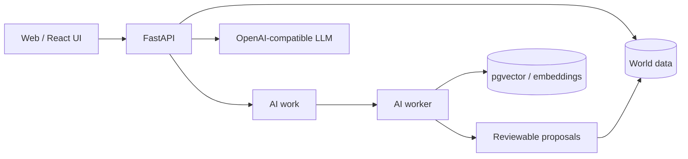

# Demiurge Assistant — Worldbuilder Core

[](https://github.com/theDAREK497/demiurge-assistant/actions/workflows/ci.yml)

A local-first knowledge system for fictional worlds, tabletop campaigns, investigations and long-running narrative projects.

The core idea is simple: **an LLM should be able to help develop a world without silently rewriting its canon**.

Demiurge Assistant keeps structured entities, relationships and world rules in a persistent knowledge base. LLM-generated information can be extracted into reviewable proposals before it becomes part of the world.

> **Status:** active engineering prototype / backend MVP. The project is usable for local experimentation, but it is not presented as a production SaaS.

## Why this project exists

Long-running fictional worlds have a different problem from ordinary chat applications:

- facts need to stay stable between sessions;
- characters and locations have relationships that matter;
- players and game masters may need different visibility;
- generated information should not automatically become canonical;
- local/offline models should be usable without redesigning the application.

Demiurge Assistant treats the LLM as a tool around a persistent world model rather than as the world model itself.

## Current capabilities

- worlds and structured wiki entities;
- stable directed relationships between entities;
- configurable world rules;
- Master/Player visibility enforced by the backend;
- JSON import/export with stable UUID preservation;
- OpenAI-compatible LLM adapter for LM Studio and similar providers;
- persistent provider configuration and model roles;
- world-aware chat;
- extraction proposals with apply/reject workflow;
- image uploads for wiki and location views;
- SQLite for simple local use;
- PostgreSQL + pgvector deployment path;
- background AI worker for embedding/extraction workflows;
- lightweight RU/EN UI plus a React/Vite frontend shell;
- local-network mode for tabletop sessions.

## Architecture



The application core is intentionally UI-independent. A browser app, desktop shell, CLI or bot can use the same HTTP API.

## Tech stack

| Area | Technology |
| --- | --- |
| Backend | Python, FastAPI |
| Local database | SQLite |
| Extended database | PostgreSQL + pgvector |
| AI integration | OpenAI-compatible API, LM Studio |
| Frontend | React, Vite + lightweight existing UI |
| Quality | Pytest, Ruff, Bandit, pip-audit, npm audit |
| Deployment | Docker Compose / local Windows workflow |

## Quick start

### Windows launcher

For the guided local setup:

```text
start_worldbuilder.bat
```

The launcher can configure local/LAN mode, port, LM Studio URL and the active model.

### Manual setup

```powershell
python -m venv .venv
.\.venv\Scripts\Activate.ps1
pip install -e .[dev]
uvicorn worldbuilder_core.main:app --reload
```

Then open:

- App: `http://127.0.0.1:8000/app/`
- API docs: `http://127.0.0.1:8000/docs`
- Health check: `http://127.0.0.1:8000/health`

## Local LLM setup

Start an OpenAI-compatible local server such as LM Studio and configure:

```powershell
$env:WORLDBUILDER_LLM_BASE_URL = "http://127.0.0.1:1234/v1"
$env:WORLDBUILDER_LLM_MODEL = "your-loaded-model"
```

The same settings can be managed from the visual app.

## PostgreSQL + pgvector

Copy `.env.example` to `.env`, configure the database and Master token, then run:

```powershell
docker compose up --build -d
```

The extended stack runs PostgreSQL/pgvector, the FastAPI application and a separate AI worker.

## Important API flows

- `GET /api/worlds/{world_id}/context` — build world context
- `POST /api/worlds/{world_id}/chat` — world-aware chat
- `POST /api/worlds/{world_id}/proposals` — create a proposal
- `POST /api/worlds/{world_id}/proposals/extract` — LLM-assisted extraction
- `POST /api/proposals/{proposal_id}/apply` — accept a proposal
- `POST /api/proposals/{proposal_id}/reject` — reject a proposal

## Quality checks

```powershell
python -m pytest
python -m compileall src tests
ruff check src tests
bandit -r src -q
pip-audit --local --skip-editable

cd frontend
npm audit
npm run build
```

## Documentation

- [Architecture](docs/ARCHITECTURE.md)
- [LLM adapter](docs/LLM.md)
- [Retrieval / RAG](docs/RAG.md)
- [UI](docs/UI.md)
- [Write-back pipeline](docs/WRITE_BACK.md)
- [Roadmap](docs/ROADMAP.md)
- [Security notes](docs/SECURITY.md)

## Design principles

1. **Persistent world first, LLM second.**
2. **Generated facts are proposals, not automatic truth.**
3. **Local models are first-class providers.**
4. **Master/Player visibility belongs in the backend, not only in the UI.**
5. **The core should remain usable from multiple clients.**

## License

MIT. See [LICENSE](LICENSE).
